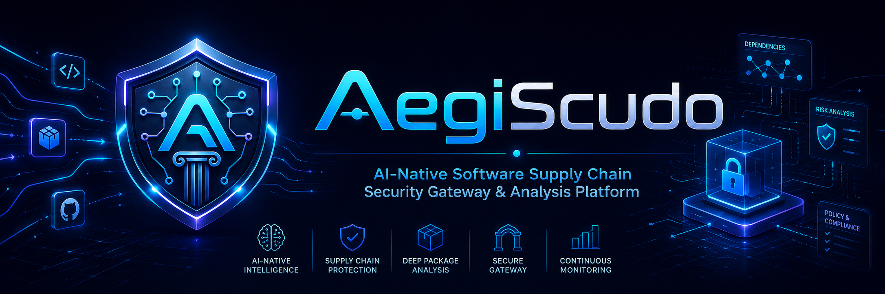

# Aegiscudo

**Aegiscudo** is an AI-native software supply chain security project being built to stop dangerous artifacts before they become normal parts of a developer workflow, CI pipeline, or release train.

Its target architecture combines a request-time registry gateway, deterministic policy decisions, static analysis, sandbox detonation, threat-intelligence enrichment, SBOM and attestation evidence, and AI-assisted explanation into one opinionated defensive system.

This repository is the open-source home for the platform foundations, contracts, service scaffolds, local infrastructure, and operator tooling.

> **Status**
> This is a foundation-stage open-source repository. Today you can run local infrastructure, schemas, migrations, the current Triage Counter and Mosquito Net request-time service shells, `aedo-cli` scaffolding, and a Command Center shell backed by mock data. Full registry admission control, real adapter-backed proxying, and end-to-end analysis workflows are still phase-gated work in progress.

## Why Aegiscudo Exists

Most traditional SCA tooling is strong at answering a narrow question:

> Is this dependency already known to be vulnerable?

Aegiscudo is built to answer the question teams actually need answered in the moment:

> Should this exact artifact be allowed into this environment right now?

That shift matters because modern supply chain attacks often arrive **before** public advisories, CVEs, or ecosystem warnings catch up. Malicious maintainers, poisoned releases, typosquatting, dependency confusion, install-script payloads, sleeper behavior, AI-agent instruction injection, and compromised publish pipelines all exploit that time gap.

Aegiscudo is designed to narrow that gap with a security control that sits directly in the dependency path.

## What The Name Means

**Aegiscudo** is a deliberate fusion of:

- **Aegis**: the Greek idea of protection, guardianship, and the legendary shield associated with divine defense.
- **Scudo**: the Italian word for **shield**.

The name intentionally doubles down on the core design philosophy: **a layered shield for the software supply chain**.

One shield stands in front of the package request path, where Aegiscudo decides whether an artifact should be admitted at all. The second shield stands behind that decision path, where deep analysis, sandboxing, SBOM evidence, and forensic review make the judgment explainable, auditable, and resilient.

## Why The Design Is Powerful

- **Request-time enforcement**: decisions happen while the package manager is resolving or downloading artifacts, not hours or days later.
- **Protocol-aware registry shielding**: npm and PyPI are handled as first-class registry protocols, not as a generic blind proxy.
- **Deterministic policy first**: AI is advisory. Enforcement remains tied to auditable policy snapshots, evidence, overrides, and traceable control flow.
- **Deep artifact inspection**: static analysis, package metadata, behavior probes, and sandbox evidence build a richer picture than CVE lookups alone.
- **Modern signal fusion**: provenance, attestations, registry signatures, Trusted Publisher signals, OSV, GHSA, CISA KEV, EPSS, Scorecard, and custom threat feeds all contribute to decisions.
- **Explainable security operations**: operators get a Command Center, evidence viewer, audit trail, and `aedo-cli` for developer and CI workflows.
- **Open-source operator posture**: the implementation is designed to be inspectable, testable, locally runnable, and explicit about trust boundaries.

## Target Platform Overview

At its intended steady state, Aegiscudo is composed of the following major parts:

| Component | Role |
|---|---|
| **Mosquito Net** | Request-time registry gateway and protocol-specific proxy |
| **Triage Counter** | Deterministic policy and decision engine |
| **Surgeon** | Rust static analysis pipeline for artifacts and extracted evidence |
| **Emergency Room** | Sandbox orchestration for behavioral detonation and telemetry |
| **AI Analyst** | Advisory explanation layer over redacted, structured evidence |
| **Feed Harvester** | Threat-intelligence ingestion and freshness tracking |
| **SBOM Service** | SBOM aggregation, export, and VEX-related workflows |
| **Command Center** | Next.js operations and review UI |
| **aedo-cli** | Developer and CI interface for scans, explanations, and future attest/SBOM flows |

The architecture is intentionally split between:

- **request-time control**: fast, deterministic, protective, and protocol-aware
- **asynchronous depth**: heavier analysis, feed processing, sandboxing, and operator review

## Target Request Path

The flow below describes the intended end-to-end behavior once request-time and asynchronous services are fully wired:

1. A developer or CI system points npm or pip-compatible tooling at Aegiscudo.
2. The registry gateway normalizes the request and asks the policy engine for a decision.
3. The policy engine evaluates known reputation, feed-backed evidence, prior verdicts, and configurable security rules.
4. Unknown or suspicious artifacts are queued for deeper analysis.
5. Static analysis, sandbox telemetry, SBOM evidence, and advisory AI explanations enrich the case.
6. The platform returns a governed result such as allow, warn, quarantine, block, or require human approval.
7. Every meaningful action is tied to audit evidence and a specific policy snapshot.

## Current Repository Status

This repository is in the **foundation and early delivery** stage. It already contains substantial scaffolding and validation work, but it should still be treated as an actively evolving system rather than a finished production release.

What is already present:

- Rust workspace foundations for shared DTOs, policy primitives, protocol types, telemetry helpers, service shells, and `aedo-cli`
- Runnable request-time Rust services for Triage Counter and Mosquito Net with health, readiness, metrics, persisted Triage decisions, partial Mosquito Net audit persistence, Triage-side unknown-artifact analysis-job queueing, and focused test coverage
- Next.js App Router Command Center scaffold with Tailwind CSS v4, TanStack Query/Table, Recharts, Framer Motion, and Radix-compatible UI primitives
- Python FastAPI foundations for Emergency Room and AI Analyst, including health, readiness, metrics, trace ID middleware, and shared sensitive-key log redaction
- JSON schemas and validation fixtures for policy, decisions, evidence, sandbox telemetry, audits, feeds, AI explanations, and attestation evidence
- PostgreSQL migrations for core tenant, registry, artifact, analysis, override, AI provider, feed snapshot, and audit models
- Local development infrastructure using Docker Compose, object storage emulation, OpenTelemetry, and Langfuse dependencies
- Architecture docs, plan tracking, and product requirements that define the source-of-truth design
- Mock-data-backed operator UI flows for the current Command Center scaffold
- Placeholder service stubs for phase-gated components such as Feed Harvester and SBOM Service

What is not yet complete:

- Full request-time package manager enforcement for all target ecosystems
- Production-ready asynchronous analysis workflows across every planned service
- Full end-to-end operator experience for all roadmap features
- Stable Phase 2 and Phase 3 capabilities such as Cargo, Maven, and OCI-focused workflows

## Repository Layout

| Path | Purpose |
|---|---|
| `apps/command-center` | Next.js operator UI |
| `apps/docs-site` | Placeholder for future documentation site |
| `cli/aedo-cli` | Rust CLI for developer and CI workflows |
| `contracts/openapi` | API contract source of truth |
| `crates/` | Shared Rust libraries |
| `docs/prd` | Product requirements source of truth |
| `docs/plan` | Phase-by-phase implementation trackers |
| `docs/architecture` | Maintained architecture documentation |
| `infra/` | Docker Compose, Kubernetes, Terraform, and fixtures |
| `migrations/` | SQL migrations |
| `packages/shared-types` | Generated/shared TypeScript types |
| `schemas/` | JSON schemas and fixtures |
| `services/` | Service implementations and scaffolds |
| `sandbox-images/` | Sandbox image definitions |
| `testdata/` | Deterministic benign and adversarial fixtures |

## Documentation Map

- Product source of truth: [docs/prd/aegiescudo-prd.md](docs/prd/aegiescudo-prd.md)
- Phase tracking: [docs/plan](docs/plan)
- Architecture overview: [docs/architecture/README.md](docs/architecture/README.md)
- Security boundaries: [docs/architecture/security-boundaries.md](docs/architecture/security-boundaries.md)

Use these sources differently:

- For **intended design and roadmap**, read the PRD and architecture documents.
- For **what you can rely on in the repository today**, use the Current Repository Status section above, the phase plans, and the code itself.

## Getting Started

### Prerequisites

- Rust 2024 toolchain compatible with the workspace settings
- Node.js 20.9 or newer
- `pnpm` 10.33.3 or compatible
- Python 3.12
- `uv` for Python environment management
- Docker and Docker Compose
- GNU Make

### Local Bootstrap

```bash
cp .env.example .env
pnpm install
uv sync
make up
make migrate
pnpm openapi:generate
```

### What You Can Use Today

The current repository has three realistic entry points:

- Local infrastructure and database state for the platform foundations
- The Command Center shell with mock data
- The current request-time Rust services: Triage Counter and Mosquito Net

What is not yet true:

- There is no finished Admin API or seed command for tenants, policy profiles, policy versions, or registry configs
- Mosquito Net does not yet perform full npm or PyPI upstream proxying
- The Command Center is not yet a fully live end-to-end control plane

### First Run Walkthrough

If you want the quickest truthful smoke test of the repository as it exists today:

```bash
make up
make migrate-check
cargo run -p aedo-cli -- --help
pnpm dev
```

What to expect:

- `make up` should bring up the local infrastructure dependencies.
- `make migrate-check` should successfully dry-run the SQL migrations against the local PostgreSQL container.
- `cargo run -p aedo-cli -- --help` should print the current CLI scaffold help output.
- `pnpm dev` should start the Command Center at the Next.js dev URL printed in the terminal, typically `http://localhost:3000`.
- The Command Center currently renders a scaffolded operator shell with mock data, not a fully live end-to-end decisioning stack.
- Langfuse should be reachable locally at `http://localhost:13001` after `make up`.
- If you want to start Triage Counter or Mosquito Net after this smoke test, run `make migrate`; `make migrate-check` validates the migrations but does not prepare runtime rows for request-time evaluation.

### Run The Current Request-Time Services

If you want to start the current Triage Counter and Mosquito Net service shells, use separate terminals after `make up` and `make migrate`:

```bash
set -a; . ./.env; set +a
cargo run -p triage-counter
```

```bash
set -a; . ./.env; set +a
cargo run -p mosquito-net
```

Default local bind addresses:

- Triage Counter: `http://127.0.0.1:8081`
- Mosquito Net: `http://127.0.0.1:8080`

Useful endpoints that work immediately once the services are running:

```bash
curl http://127.0.0.1:8081/healthz
curl http://127.0.0.1:8081/metrics
curl http://127.0.0.1:8080/healthz
curl http://127.0.0.1:8080/metrics
```

Current request-time limitation:

- Triage Counter and Mosquito Net require migrated PostgreSQL state plus existing `tenants`, `policy_profiles`, `policy_versions`, and `registry_configs` rows before `/v1/decisions/evaluate` or `/proxy/{*proxy_path}` can do useful work.
- There is not yet a finished Admin API or repository seed command that creates that runtime state for you.
- Because the adapter-backed proxy path is still incomplete, the most reliable way to exercise current decision behavior remains the focused Rust test suites.

### Exercise The Implemented Decision Path Today

If you want to exercise current request-time behavior without hand-seeding PostgreSQL rows, use the focused service tests:

```bash
cargo test -p triage-counter
cargo test -p mosquito-net
```

These tests currently cover the implemented decision engine, policy precedence, persisted decision and analysis-job behavior, Mosquito Net advisory and fail-mode handling, and the request-time behaviors that are already wired in the repository.

### Common Validation Commands

```bash
cargo test --workspace
pnpm lint
pnpm typecheck
pnpm test
pnpm schema:validate
uv run pytest
uv run ruff check services/python-common services/emergency-room services/ai-analyst
uv run mypy services/emergency-room services/ai-analyst
make migrate-check
```

### Local Infrastructure Notes

`make up` starts local PostgreSQL, Redis, MinIO-compatible storage, OpenTelemetry collector, and Langfuse dependencies.

Compose defaults intentionally use higher localhost ports to avoid common collisions on developer machines:

- PostgreSQL: `15432`
- Langfuse PostgreSQL: `15433`
- Redis: `16379`
- MinIO API: `19000`
- MinIO console: `19001`
- Langfuse: `13001`
- OpenTelemetry: `14317` and `14318`

Override them in `.env` if your environment needs different values.

## Security Model In One Paragraph

Aegiscudo assumes package archives, metadata, READMEs, comments, provenance objects, attestations, and AI-agent instruction files are adversarial input. It does not trust LLM output as an enforcement authority, it does not execute untrusted package code outside sandbox profiles, and it treats provenance or signature verification as proof of identity or integrity properties, not proof that software is benign.

## Open Source Project Expectations

This project is open for public development, but it should be approached as a **foundation-stage security platform**, not a finished self-hosting release. The repository should be understandable, reviewable, and safe for outside contributors without losing the rigor required for a security platform.

Please read the following before contributing:

- Contribution guide: [CONTRIBUTING.md](CONTRIBUTING.md)
- Security policy: [SECURITY.md](SECURITY.md)
- MIT license: [LICENSE](LICENSE)

## Secret Handling

Copy [.env.example](.env.example) to `.env` for local development.

- Never commit `.env` or real credentials.
- Never commit production tokens, auth headers, or cloud keys.
- Never add real malicious samples that can escape the deterministic test harness model.
- Use a secrets manager or platform secret store for production deployments.

## Contributing

Contributions are welcome, especially in these areas:

- protocol correctness for registry behavior
- analysis depth and evidence quality
- sandbox safety and deterministic testing
- contracts, schemas, and type generation
- operator UX and documentation
- test fixtures for realistic benign and adversarial cases

For workflow and review expectations, see [CONTRIBUTING.md](CONTRIBUTING.md).

## License

This project is licensed under the [MIT License](LICENSE).