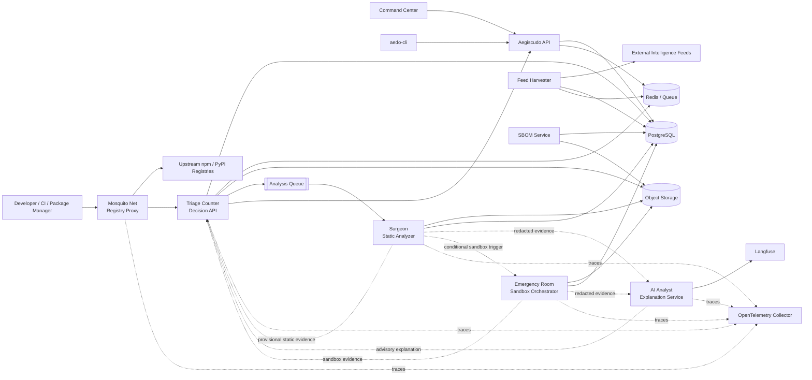

	

# Aegiscudo Architecture

Source PRD sections: [3.1 through 3.7](../prd/aegiescudo-prd.md), [4.1 through 4.8](../prd/aegiescudo-prd.md), and Production Readiness Gate.

This folder is the canonical location for maintained Aegiscudo architecture documentation. If behavior is ambiguous, resolve it from the PRD first.

## High-Level Architecture

## Architecture Principles

- Request-time enforcement belongs to [Mosquito Net](components/mosquito-net.md) and [Triage Counter](components/triage-counter.md) only.
- Heavy static analysis, sandbox execution, feed ingestion, SBOM aggregation, and AI explanations are asynchronous.
- Package archives, metadata, READMEs, comments, registry responses, attestations, and AI-agent instruction files are adversarial input.
- Surgeon is deterministic static analysis. It never calls an AI CLI and never sends whole package source files to AI Analyst.
- LLM output is advisory only. Deterministic policy, evidence, overrides, and audit records remain the enforcement authority.
- Registry proxying is protocol-specific configured proxying. Aegiscudo does not introduce transparent packet-level proxying.
- Attestation, provenance, signatures, Trusted Publisher, and similar signals prove identity or integrity properties, not benign behavior.

## Component Documents

| Component | Architecture Doc | Runtime Path |
|---|---|---|
| Mosquito Net registry proxy | [components/mosquito-net.md](components/mosquito-net.md) | Request-time |
| Triage Counter decision API | [components/triage-counter.md](components/triage-counter.md) | Request-time |
| Surgeon static analyzer | [components/surgeon.md](components/surgeon.md) | Asynchronous analysis |
| Emergency Room sandbox orchestrator | [components/emergency-room.md](components/emergency-room.md) | Asynchronous analysis |
| AI Analyst explanation service | [components/ai-analyst.md](components/ai-analyst.md) | Asynchronous analysis |
| Feed Harvester | [components/feed-harvester.md](components/feed-harvester.md) | Asynchronous ingestion |
| SBOM Service | [components/sbom-service.md](components/sbom-service.md) | Asynchronous aggregation/API |
| Aegiscudo API | [components/aegiscudo-api.md](components/aegiscudo-api.md) | Dashboard, CLI, admin API |
| Command Center | [components/command-center.md](components/command-center.md) | Operator UI |
| aedo-cli | [components/aedo-cli.md](components/aedo-cli.md) | Developer and CI interface |

## Capability By Phase

Use this matrix as the canonical summary for phase-gated platform support. Component docs should defer to this table when describing whether a capability is MVP, Phase 2, or Phase 3 scope.

| Capability | Phase 0 | Phase 1A | Phase 1B | Phase 1C | Phase 1D | Phase 2 | Phase 3 |
|---|---|---|---|---|---|---|---|
| npm and PyPI registry proxying | Scaffold only | MVP delivery | Operates with analysis results | UI and CLI surfaces | Release hardening | Supported | Supported |
| Feed-backed request-time decisions | Schemas and fixtures | MVP snapshots and cache-backed decisions | Supported | Admin visibility | Release hardening | Expanded signals | Expanded signals |
| Static analysis, sandboxing, and advisory AI explanations | Schemas and fixtures | Queue and orchestration hooks | MVP delivery | Evidence review surfaces | Release hardening | Supported | Supported |
| Command Center and `aedo-cli` for npm and PyPI workflows | Foundations only | API contracts only | Evidence producers available | MVP delivery | Release hardening | Expanded workflows | Expanded workflows |
| SBOM, VEX, and compliance exports | Schema placeholders only | Not yet supported | Not yet supported | Not yet supported | Not yet supported | MVP for this capability | Expanded compliance/reporting |
| Cargo and Maven ecosystems | Shared enums only | Not yet supported | Not yet supported | Explicit unsupported responses | Explicit unsupported responses | MVP for this capability | Supported |
| OCI or Docker image scanning and proxying | Not yet supported | Not yet supported | Not yet supported | Not yet supported | Not yet supported | Design only | MVP for this capability |
| IDE and extension ecosystem scanning | Not yet supported | Not yet supported | Not yet supported | Not yet supported | Not yet supported | Design only | MVP for this capability |

## Cross-Cutting Architecture

- [Authentication and identity](auth-and-identity.md)
- [Policy and decisions](policy-and-decisions.md)
- [Data and storage](data-and-storage.md)
- [External integrations and feeds](external-integrations.md)
- [Security boundaries](security-boundaries.md)
- [Deployment and operations](deployment-and-operations.md)

## Architecture Decisions

- [ADR index](../adr/README.md)
- [ADR 0001: Control-Plane Routing Scope and Mount-Path Uniqueness](../adr/0001-control-plane-routing-scope-and-mount-path-uniqueness.md)
- [ADR 0002: Degraded Operation and Fail-Mode Precedence](../adr/0002-degraded-operation-and-fail-mode-precedence.md)

## Maintenance Rule

Update the affected architecture document whenever service boundaries, data flow, integration behavior, deployment topology, security boundaries, or operational assumptions change. Record the architectural choice itself in [docs/adr](../adr/README.md) whenever the change alters system shape or cross-cutting behavior.